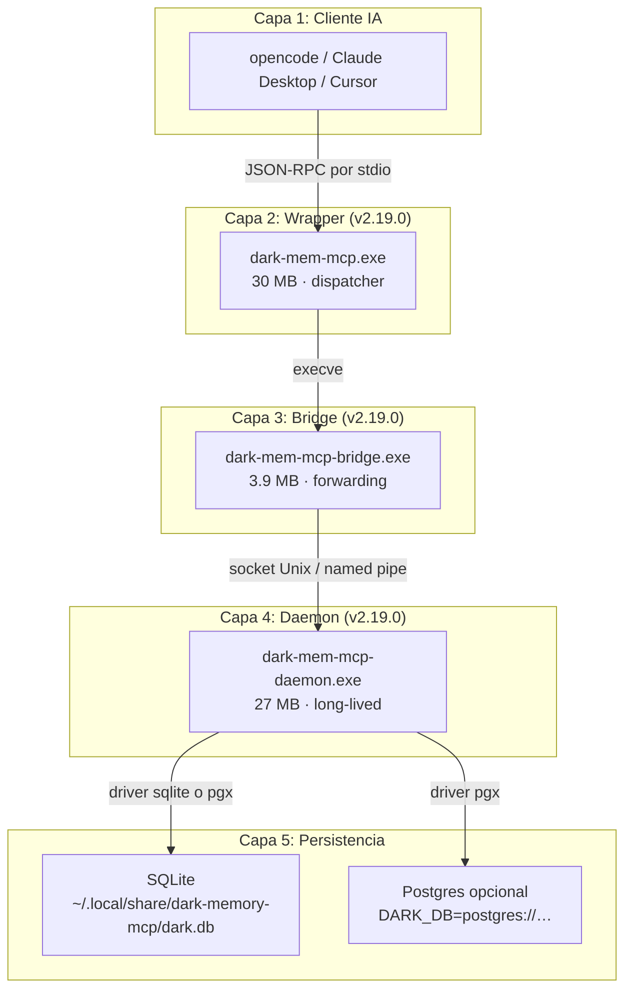
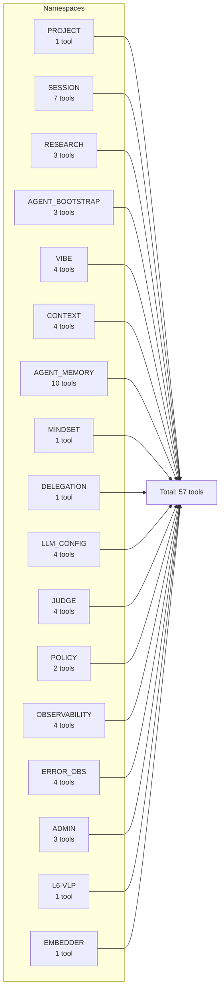
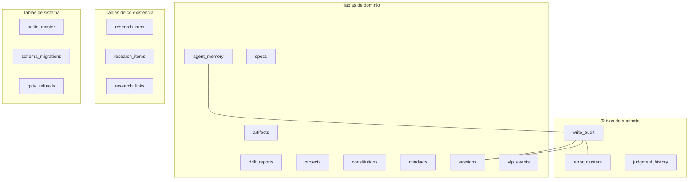

# Arquitectura — dark-memory-mcp v2.19.0

> **TL;DR**: `dark-memory-mcp` es un servidor MCP (Model Context
> Protocol) que da a los agentes de IA **memoria persistente** entre
> sesiones, **auditoría forense** de cada escritura, y un **ciclo
> de verificación** (vibe-loop) que valida automáticamente que el
> código entregado cumple lo prometido. La versión v2.19.0 introduce
> un patrón **dispatcher → bridge → daemon** para eliminar la
> dependencia del binario del ciclo de vida de opencode.

---

## 1. Contexto y motivación

### 1.1 El problema

Los LLMs no tienen memoria persistente. Cada conversación empieza
desde cero. Si un agente descubre algo importante en la sesión 3 y
quiere usarlo en la sesión 47, necesita una memoria externa.

Tres propiedades que la memoria externa debe tener para que un
agente confíe en ella:

1. **Persistencia**: la memoria sobrevive a la sesión, al proceso,
   y al reinicio del host.
2. **Auditoría**: cada escritura queda registrada con autor,
   timestamp, y constitución. Sin esto, post-mortem es imposible.
3. **Verificación**: lo que el código hace coincide con lo que el
   spec promete. Sin esto, los agentes alucinan.

### 1.2 Por qué v2.19.0 cambió la arquitectura

Antes de v2.19.0, `dark-mem-mcp` era un **binario monolítico** de
~30 MB. Cada vez que opencode iniciaba una sesión, ese binario se
lanzaba de cero: leía el schema, aplicaba migraciones, registraba
53 herramientas, y abría la DB. Esto causaba:

- **Costo de boot por sesión**: ~2 segundos en Windows, ~500 ms
  en Linux. Multiplicado por cada sesión de opencode (típicamente
  3-5 por día).
- **Race condition en arranques paralelos**: si dos sesiones de
  opencode arrancan simultáneamente, ambas pelean por el lock de
  la DB. Esto fue documentado en GitHub issue [#41996] del
  proyecto opencode.
- **Sin auto-update**: para actualizar el binario, había que
  reiniciar opencode.

A partir de v2.19.0, el binario se divide en tres:

- **Daemon** (larga duración, persistente entre sesiones de opencode)
- **Bridge** (lanzado por sesión, ligero, ~4 MB)
- **Dispatcher** (envoltorio, decide entre bridge y modo legacy)

---

## 2. Diseño

### 2.1 Vista de capas (la fuente de verdad)



**Lectura del diagrama**:

- El **cliente IA** (opencode, Claude Desktop) habla JSON-RPC sobre
  stdio con el binario `dark-mem-mcp`.
- El **dispatcher** decide si arranca el bridge (modo por defecto) o
  el modo legacy (binario único). Esa decisión es determinística.
- El **bridge** es un forwarder puro: lee de stdin, escribe al
  socket; lee del socket, escribe a stdout. No toca la DB.
- El **daemon** es el proceso de larga duración. Posee la
  conexión a la DB, mantiene las 57 herramientas registradas, y
  ejecuta la lógica del vibe-loop.

### 2.2 Vista lógica (los 57 nombres)



**Lectura del diagrama**:

- 17 namespaces agrupan las 57 herramientas por función.
- Las herramientas de `AGENT_MEMORY` (10) son las más usadas.
- Las de `SESSION` (7) son la columna vertebral de la auditoría.
- Las de `JUDGE` (4) son la columna vertebral del vibe-loop.

### 2.3 Vista de datos (las 18 tablas)



**Lectura del diagrama**:

- `write_audit` es la tabla central: toda escritura en `agent_memory`,
  `sessions`, etc. genera una fila aquí. Esto es **INV-1** (audit
  write-path).
- `error_clusters` agrupa errores recurrentes para triage del
  Error Observatory.
- `schema_migrations` registra la versión actual y la historia
  de migraciones aplicadas.

### 2.4 Los 8 invariantes (el contrato)

Cada uno se enforce en el código Go, no en la documentación.

| ID | Invariante | Enforcement | Test |
|---|---|---|---|
| INV-1 | Cada `Save*` inserta en `write_audit` en la misma transacción | `Store.Save*` con `WriteContext` | `internal/store/audit_test.go` |
| INV-2 | Toda escritura requiere `WriteContext` no-cero | `internal/policy.PostCheck` | `internal/policy/postcheck_test.go` |
| INV-3 | Errores fatales se registran en `error_clusters` | `internal/observ/observatory.go` | `tests/observatory/` |
| INV-4 | Constitución activa se lee de la DB, no del FS | `internal/policy/store.go` | `tests/invariants/` |
| INV-5 | Drift detectado bloquea execute hasta `resolve_drift` | `internal/policy/gate.go` | `tests/invariants/gate_test.go` |
| INV-6 | Toda sesión tiene `project_id` | `internal/session/session.go` | `internal/session/session_test.go` |
| INV-7 | Visibilidad de `agent_memory` limitada al proyecto activo | `internal/agent_memory/list.go` | `tests/cross_project_test.go` |
| INV-8 | Sesiones cerradas con `aborted` son resurrectable | `internal/session/sweeper.go` | `tests/invariants/session_test.go` |

**Lectura de la tabla**: cada fila es un invariante enforced en el
código. Romper cualquiera es un breaking change que requiere bump
de major version.

**Véase**: [INVARIANTS.md](./INVARIANTS.md) para el detalle completo.

---

## 3. Decisiones clave

### 3.1 ¿Por qué split en 3 binarios?

**Decisión**: separar el dispatcher (envoltorio), el bridge
(forwarder), y el daemon (lógica).

**Alternativas consideradas**:

- **A**: binario monolítico (lo que era antes de v2.19.0).
- **B**: dos binarios (dispatcher + daemon).
- **C**: tres binarios (dispatcher + bridge + daemon).

**Por qué C**: la opción B tenía un problema: el daemon era
lanzado por el dispatcher, lo que significaba que el daemon moría
cuando opencode se cerraba. La opción C introduce un bridge que es
tan ligero que su costo de spawn es despreciable, y un daemon que
sobrevive a opencode.

**Trade-off**: +1 binario que distribuir, +1 socket de Unix para
mantener, +1 ready-file que coordinar.

**Métrica de éxito**: el daemon sobrevive a 100+ sesiones de
opencode. Cada sesión de opencode paga <50 ms de bridge handshake.

### 3.2 ¿Por qué SQLite por defecto?

**Decisión**: el binario usa SQLite por defecto, con Postgres
opcional.

**Alternativas consideradas**:

- **A**: Postgres obligatorio.
- **B**: SQLite obligatorio.
- **C**: SQLite por defecto, Postgres opt-in.

**Por qué C**: la mayoría de los operadores corren dark-memory en
una sola máquina. SQLite es zero-config y rápido para <100k filas.
Postgres es necesario solo para multi-host o >1M filas.

**Trade-off**: las migraciones de SQLite a Postgres requieren
script manual (ver [MIGRATION.md](./MIGRATION.md)).

### 3.3 ¿Por qué JSON-RPC sobre stdio?

**Decisión**: el transporte MCP es JSON-RPC sobre stdio.

**Alternativas**:

- **A**: HTTP+SSE.
- **B**: WebSocket.
- **C**: stdio (el standard MCP).

**Por qué C**: stdio es el estándar de MCP. Cero configuración de
red. Cero firewall. Cero TLS. El daemon usa socket Unix/named
pipe para su comunicación interna, no HTTP.

**Trade-off**: depurar el wire requiere `cat | tee` entre cliente
y servidor. La complejidad está en el bridge, no en el wire.

### 3.4 ¿Por qué LLM-as-judge?

**Decisión**: el vibe-loop usa un LLM externo (judge) para
verificar que un artifact cumple lo que el spec promete.

**Alternativas**:

- **A**: tests unitarios solamente.
- **B**: tests + revisión humana.
- **C**: tests + LLM-as-judge.

**Por qué C**: los tests unitarios verifican código; no verifican
que el código cumple expectativas de producto. La revisión humana
es cara y lenta. El judge es un trade-off entre ambos: veloz,
escala, y captura semántica.

**Trade-off**: el judge es no-determinista. El mismo artifact
puede dar `aligned` y `drift_detected` en runs consecutivos. Por
eso usamos `consensus(n=3)` para claims de alta stake.

---

## 4. Trade-offs globales

| Ganancia | Costo |
|---|---|
| Memoria persistente entre sesiones | Una DB local que mantener |
| Auditoría forense de cada cambio | Overhead de 1 INSERT por Save |
| Verificación automática con drift_judge | No-determinismo del judge |
| Compatibilidad con cualquier cliente MCP | Limita a JSON-RPC 2.0 |
| Backwards compat (DARK_MEM_BRIDGE=0) | Mantiene 2 code paths de boot |
| Arquitectura split (v2.19.0) | 3 binarios + 1 socket + 1 ready-file |

---

## 5. Operación

### 5.1 Arranque típico

```bash
# 1. El operador instala dark-memory-mcp
go install github.com/dark-agents/dark-memory-mcp/cmd/dark-mem-mcp@latest

# 2. Configura opencode.jsonc para que opencode use el MCP
# (ver docs/mcpb-install.md)

# 3. Abre opencode. Internamente:
#    a. opencode spawna dark-mem-mcp.exe (dispatcher)
#    b. dispatcher detecta el bridge (3.9 MB) alongside
#    c. dispatcher execve → dark-mem-mcp-bridge.exe
#    d. bridge conecta al daemon socket (or spawn si idle)
#    e. daemon responde a initialize
#    f. JSON-RPC fluye
```

### 5.2 Shutdown

```bash
# Cuando opencode cierra:
#    a. bridge recibe SIGPIPE (stdin cerrado)
#    b. bridge graceful shutdown
#    c. daemon no se toca (sigue vivo)
#    d. cuando la última sesión de opencode se cierra:
#       - sweeper del daemon detecta idle
#       - después de 30 minutos, daemon se apaga
```

### 5.3 Observabilidad

```bash
# Health ping
curl -X POST -d '{"jsonrpc":"2.0","method":"health_ping","id":1}' \
  --unix-socket ~/.dark-agents/daemon.sock \
  http://localhost/

# Logs estructurados
tail -f ~/.local/share/dark-memory-mcp/dark.log

# Métricas (si está habilitado)
curl -X POST -d '{"jsonrpc":"2.0","method":"memory_state","id":1}' \
  --unix-socket ~/.dark-agents/daemon.sock \
  http://localhost/
```

**Véase**: [RUNBOOK.md](./RUNBOOK.md) para troubleshooting.

---

## 6. Referencias

### 6.1 Documentos del proyecto

- [MANIFIESTO.md](./MANIFIESTO.md) — constitución de la documentación.
- [GLOSARIO.md](./GLOSARIO.md) — jerga del proyecto.
- [INVARIANTS.md](./INVARIANTS.md) — los 8 invariantes operativos.
- [RUNBOOK.md](./RUNBOOK.md) — operación day-2.
- [MIGRATION.md](./MIGRATION.md) — SQLite → Postgres.
- [COEXISTENCE.md](./COEXISTENCE.md) — dark-memory + dark-research.
- [CONSTITUTION.md](../CONSTITUTION.md) — constitución técnica.

### 6.2 Estándares externos

- [MCP Specification](https://modelcontextprotocol.io/) — el
  protocolo que seguimos.
- [JSON-RPC 2.0](https://www.jsonrpc.org/specification) — el
  formato de los mensajes.
- [SQLite documentation](https://www.sqlite.org/docs.html) — el
  motor de DB.
- [PostgreSQL documentation](https://www.postgresql.org/docs/) —
  el motor alternativo.

### 6.3 Literatura citada

- Hick, W. E. (1952). "On the rate of gain of information".
  *Quarterly Journal of Experimental Psychology*.
- Fitts, P. M. (1954). "The information capacity of the human
  motor system". *Journal of Experimental Psychology*.
- Claessen, K., & Hughes, J. (2000). "QuickCheck: A Lightweight
  Tool for Random Testing of Haskell Programs". *ICFP*.
- MacIver, D. (2019). "Hypothesis — How does this work?" —
  shrinker design.

### 6.4 Versión

- **Esta versión**: v2.19.0 (2026-08-14).
- **Autor**: Nico (operador), con la comunidad técnica de la
  universidad de Colombia.
- **Estado**: SHIPPED + CI GREEN, ver [CHANGELOG.md](../CHANGELOG.md).
