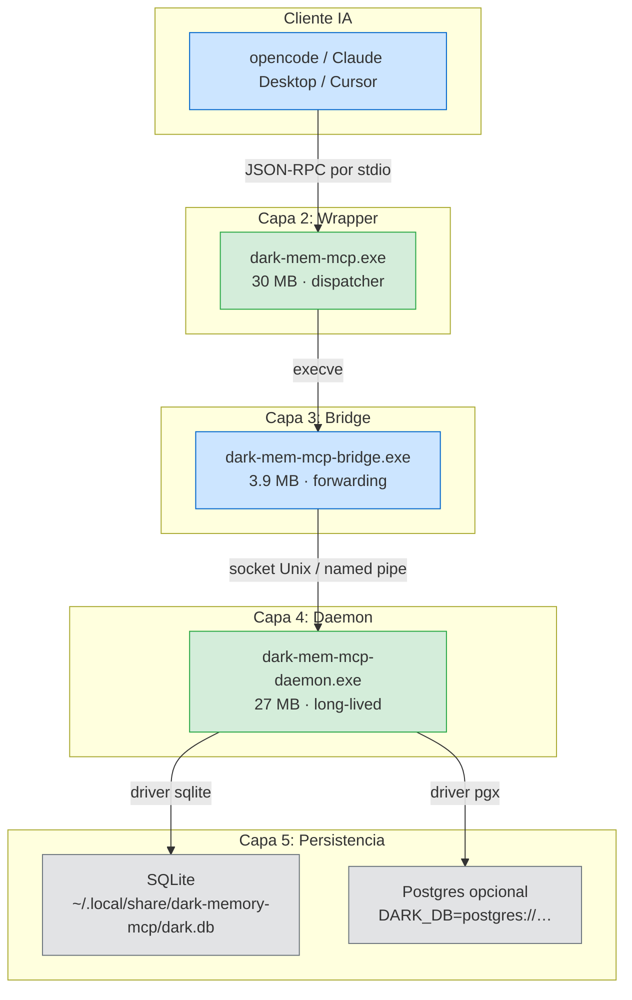
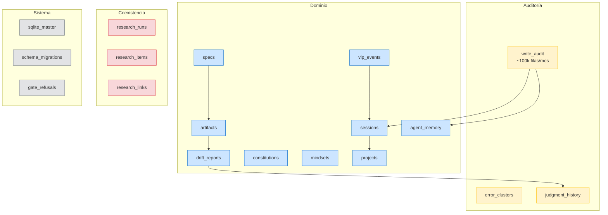
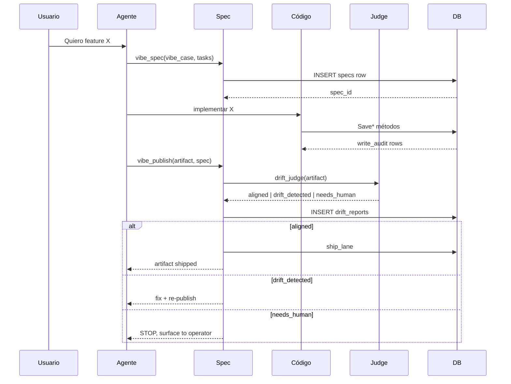
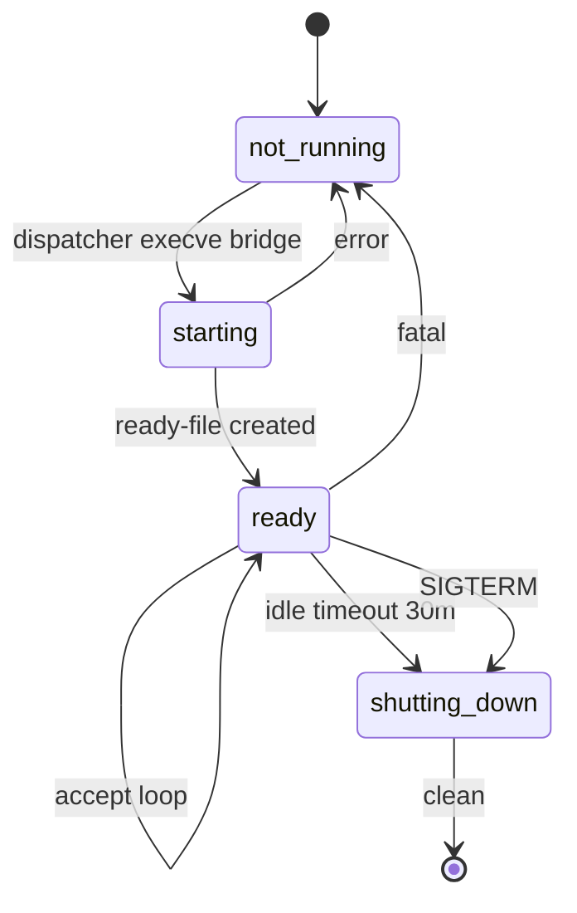
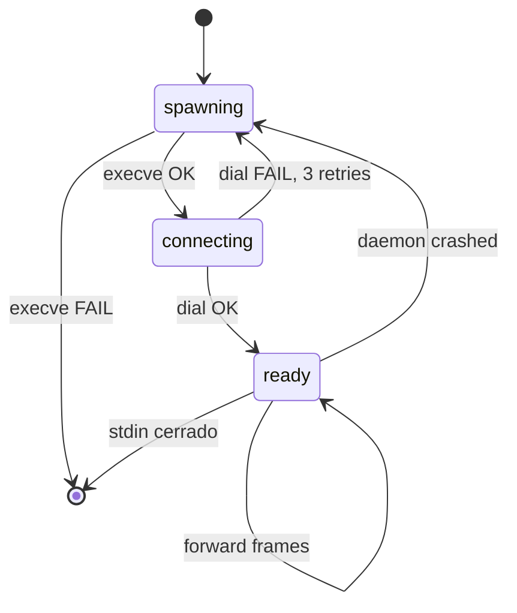
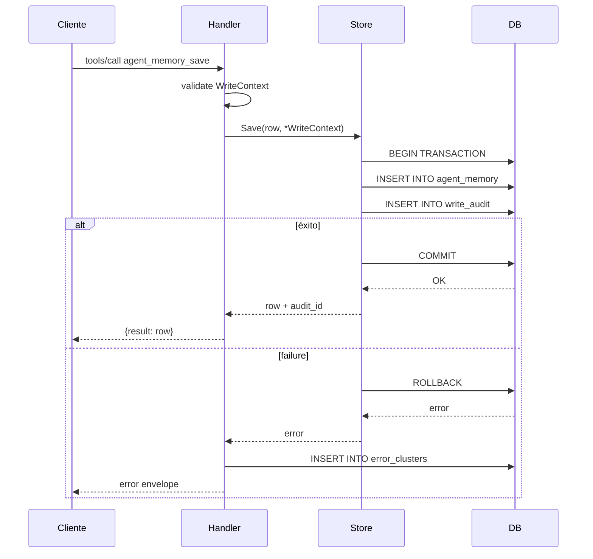
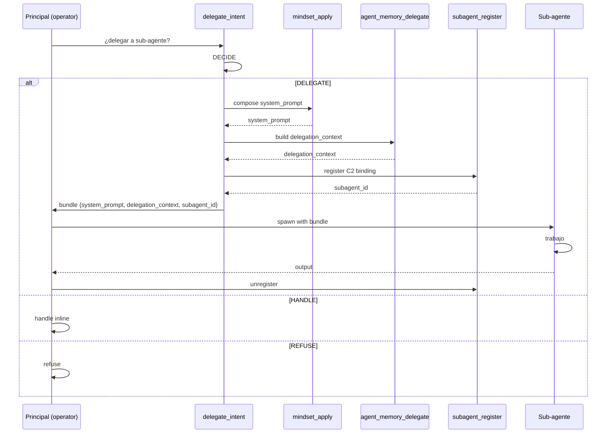
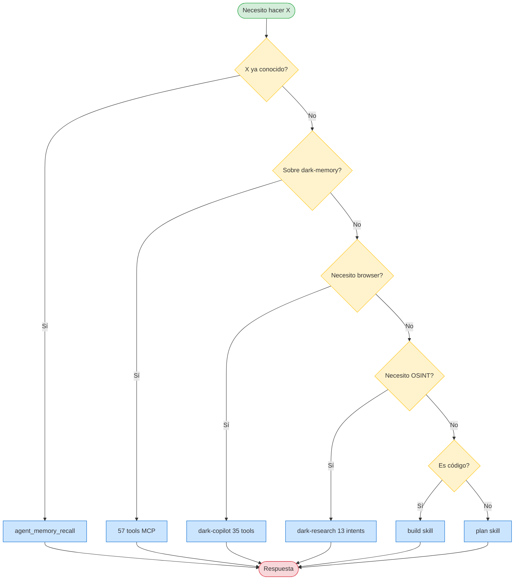

# Diagramas — dark-memory-mcp v2.19.0

> **TL;DR**: Este documento agrupa todos los diagramas del proyecto
> en un solo lugar. Cada diagrama está en formato **Mermaid** (que
> renderiza en GitHub, GitLab, VS Code y la mayoría de los
> visualizadores Markdown). Los diagramas se referencian desde
> otros documentos (no se duplican).

---

## 0. Convención de colores

Todos los diagramas usan la misma convención:

| Color | Significado |
|---|---|
| 🟢 Verde | Estado saludable, ruta correcta |
| 🟡 Amarillo | Advertencia, decisión pendiente |
| 🔴 Rojo | Error, estado terminal |
| 🔵 Azul | Flujo normal, datos en tránsito |
| ⚪ Gris | Estado neutro, componente pasivo |

En Mermaid, esto se aplica con `classDef` y `class`.

---

## 1. Vista de capas (deployment)

**Lectura**: deployment físico de los 3 binarios + 2 posibles DBs.
**Usado en**: [ARCHITECTURE.md §2.1](./ARCHITECTURE.md#21-vista-de-capas-la-fuente-de-verdad).

---

## 2. Vista lógica (namespaces)

```mermaid
graph LR
    subgraph "PROJECT (1)"
        N1[project_create]
    end
    subgraph "SESSION (7)"
        N2[session_start<br/>session_resume<br/>session_heartbeat<br/>session_status<br/>session_close<br/>session_recover<br/>session_resurrect]
    end
    subgraph "RESEARCH (3)"
        N3[research_topic<br/>research_recall<br/>research_resume_thread]
    end
    subgraph "BOOTSTRAP (3)"
        N4[agent_bootstrap<br/>agent_recommend_companions<br/>agent_detect_environment]
    end
    subgraph "VIBE (4)"
        N5[vibe_publish<br/>vibe_spec<br/>pipeline_status<br/>resolve_drift]
    end
    subgraph "CONTEXT (4)"
        N6[recall<br/>artifact_context<br/>spec_context<br/>session_context]
    end
    subgraph "AGENT_MEMORY (10)"
        N7[agent_memory_save<br/>agent_memory_list<br/>agent_memory_recall<br/>agent_memory_get<br/>agent_memory_update<br/>agent_memory_archive<br/>agent_memory_delegate<br/>agent_memory_entities<br/>subagent_register<br/>subagent_unregister]
    end
    subgraph "MINDSET (1)"
        N8[mindset_apply]
    end
    subgraph "DELEGATION (1)"
        N9[delegate_intent]
    end
    subgraph "JUDGE (3)"
        N10[judge<br/>consensus<br/>judgment_history]
    end
    subgraph "POLICY (2)"
        N11[active_policy<br/>load_constitution]
    end
    subgraph "OBSERVABILITY (4)"
        N12[health_ping<br/>memory_state<br/>writes<br/>anomalies]
    end
    subgraph "ERROR_OBS (4)"
        N13[error_summary<br/>error_list<br/>error_get<br/>error_resolve]
    end
    subgraph "ADMIN (3)"
        N14[admin_migrate<br/>admin_schema_status<br/>admin_vacuum]
    end
    subgraph "L6-VLP (1)"
        N15[vlp_handle_event]
    end
    subgraph "EMBEDDER (1)"
        N16[embedder_setup_prompt]
    end

    N1 --> T["Total: 57 tools"]
    N2 --> T
    N3 --> T
    N4 --> T
    N5 --> T
    N6 --> T
    N7 --> T
    N8 --> T
    N9 --> T
    N10 --> T
    N11 --> T
    N12 --> T
    N13 --> T
    N14 --> T
    N15 --> T
    N16 --> T

    classDef totalNode fill:#d4edda,stroke:#28a745,stroke-width:3px
    class T totalNode
```

**Lectura**: 17 namespaces → 57 tools.

**Usado en**: [ARCHITECTURE.md §2.2](./ARCHITECTURE.md#22-vista-lógica-los-57-nombres).

---

## 3. Vista de datos (las 18 tablas)

**Lectura**: 4 categorías de tablas, `write_audit` como nodo
central.

**Usado en**: [ARCHITECTURE.md §2.3](./ARCHITECTURE.md#23-vista-de-datos-las-18-tablas).

---

## 4. Flujo del vibe-loop (la verificación)

**Lectura**: el ciclo completo desde intención del usuario hasta
ship.

**Usado en**: [README.md](../README.md#el-vibe-loop-un-paradigma-nuevo).

---

## 5. Lifecycle del daemon (FSM)

**Lectura**: 4 estados, transiciones del daemon.

**Usado en**: [RUNBOOK.md §Daemon lifecycle](./RUNBOOK.md#daemon-lifecycle).

---

## 6. Lifecycle del bridge (FSM)

**Lectura**: 4 estados, el bridge se re-spawn si el daemon se cae.

**Usado en**: [ARCHITECTURE.md §2.1](./ARCHITECTURE.md#21-vista-de-capas-la-fuente-de-verdad).

---

## 7. Auditoría de un Save (secuencia)

**Lectura**: cada Save tiene 2 INSERTs en la misma transacción.
Esto es **INV-1**.

**Usado en**: [INVARIANTS.md §INV-1](./INVARIANTS.md#inv-1--auditoría-en-el-camino-de-escritura).

---

## 8. Despliegue de un agente con subagente

**Lectura**: el patrón de delegación, paso a paso.

**Usado en**: [skills/dark-memory/SKILL.md §1.7](../.config/opencode/skills/dark-memory/SKILL.md).

---

## 9. Stack de decisiones (cómo se elige)

**Lectura**: el árbol de decisión para qué herramienta usar.

**Usado en**: el sistema-prompt de dark-agent.

---

## 10. Notas técnicas

### 10.1 Renderizado de Mermaid

Mermaid renderiza en:

- GitHub: nativo en el visor de PRs.
- GitLab: nativo desde 13.0.
- VS Code: con la extensión "Markdown Preview Mermaid Support".
- IntelliJ: con el plugin "Markdown Navigator".
- Vim: con `markdown-preview.nvim`.

### 10.2 Edición de los diagramas

Para modificar un diagrama:

1. Edita el bloque Mermaid en este archivo.
2. Verifica en GitHub después del push.
3. Si la edición es profunda (cambio de capas), actualiza el
   `## Change log` al final de este documento.

### 10.3 Limitaciones

- Mermaid no tiene iconos personalizados. Si necesitas íconos
  específicos, usa un PNG externo.
- Mermaid tiene un límite de ~1000 nodos. Para diagramas más
  grandes, divide en varios.

---

## 11. Change log

- **2026-08-14** (v2.19.0): diagrama 1 actualizado para incluir
  dispatcher/bridge/daemon. Diagrama 6 (lifecycle del bridge) es
  nuevo.
- **2026-08-13** (v2.18.0): sin cambios. Diagrama 2 actualizado
  para incluir el nuevo `judge_list_personas` (53 → 54 tools,
  JUDGE ganó 1 tool).
- **2026-08-11** (v2.15.0): diagramas 4, 7, 8 creados.
- **2026-08-08** (v2.13.0): diagramas 1, 2, 3, 5, 9 originales.
