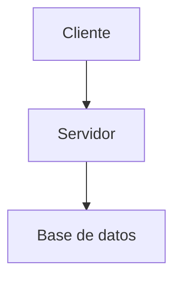

# Manifiesto de Documentación — dark-memory-mcp

> **TL;DR**: Este documento define cómo escribimos documentación en
> `dark-memory-mcp`. Es la constitución que siguen todos los `docs/*.md`,
> `README.md`, `CONTRIBUTING.md`, y comentarios extensos en código.
> Aplica rigor de **dark-testing** (5 principios + 14 anti-patrones) sobre
> el texto. La audiencia objetivo es triple: **estudiantes universitarios
> colombianos** que aprenden, **profesores** que auditan, y **LLMs** que
> aprenden del repositorio.

---

## 0. Por qué este documento existe

Tres hechos juntos crearon una deuda:

1. El código de `dark-memory-mcp` está en inglés (es lo natural para un
   proyecto Go open-source).
2. La documentación también está en inglés, en parte porque la
   comunidad open-source internacional es la audiencia primaria.
3. La **comunidad técnica de la universidad del operador** habla español
   tuteado de Colombia, y ahora está auditando el código.

La auditoría técnica funciona si la documentación cumple tres mandatos
al tiempo:

- **Para LLMs**: estructura machine-readable, jerarquía explícita,
  anchors estables, frontmatter opcional, sin prosa decorativa.
- **Para estudiantes**: jerga definida al primer uso, ejemplos
  copy-pasteables, caminos de aprendizaje progresivo.
- **Para profesores**: rigor formal, justificaciones de decisiones,
  referencias cruzadas, separación clara entre hechos y opiniones.

Español tuteado **no** significa regionalismos. No usamos "opita", ni
"paisa", ni "costeño". Usamos español neutro, tuteado, técnico.

---

## 1. Tres audiencias, un documento

| Audiencia | Qué necesita | Dónde lo encuentra |
|---|---|---|
| **Estudiante U** (CS / CE, intermedio) | Jerga definida, tutorial paso a paso, ejemplos copy-paste | `TUTORIAL.md`, `README.md`, glosario inline |
| **Profesor** (auditor académico) | Rigor formal, decisiones justificadas, referencias cruzadas | `ARCHITECTURE.md`, `INVARIANTS.md`, este `MANIFIESTO.md` |
| **Auditor técnico** (open source) | Por qué esta decisión, qué alternativas se descartaron, qué trade-offs | `DECISION_MATRIX.md`, `ADRs` (futuro), `CHANGELOG.md` |
| **LLM** (modelo de lenguaje) | Estructura explícita, cross-refs `[texto](archivo.md)`, anchors | Todo el repo, pero especialmente este `MANIFIESTO.md` y los frontmatter |

**Regla de prioridad**: cuando dos audiencias entran en tensión, gana
la **auditoría académica**. Esto significa: si hay que elegir entre
una explicación más larga y clara para estudiante y una justificación
formal para profesor, **gana el profesor** (la versión larga cubre a
los dos).

---

## 2. Reglas de estilo

### 2.1 Tono y registro

- **Español tuteado de Colombia**: usa **tú** sistemáticamente. No
  uses ustedeo (él/ella hizo...), no uses voseo (vos hiciste...).
- **Voz activa preferida**: "El servidor escribe la fila" en vez de
  "La fila es escrita por el servidor".
- **Presente para describir el código**: "la función retorna el
  puntero", no "retornará".
- **Pasado para historia**: "v2.6.0 introdujo la auditoría",
  no "introduce".
- **Sin regionalismos**: no uses "chevere", "parce", "bacano",
  "gonorrea". Tampoco uses "guay", "mola", "chévere" (español de España).
- **Sin coletillas coloquiales**: no "vale", "ok", "bueno", "pues".
- **Pragmatismo moderado**: usa contracciones estándar (del, al, por
  el, en el) pero no abuses (no "xq", "tb", "tk").

### 2.2 Vocabulario técnico

**Anglicismos aceptados** (son jerga técnica consolidada, no tienen
traducción razonable):

| Inglés | Español aceptado | Por qué |
|---|---|---|
| handler | handler | Cada traducción ("manejador") suena forzada |
| dispatcher | dispatcher | Estándar en arquitectura de software |
| bridge | bridge | Vocablo físico de la metáfora |
| daemon | daemon | POSIX lo define así |
| drift | drift | Vocablo de IA/ML consolidado |
| judge | judge | Vocablo de LLM-as-judge |
| prompt | prompt | Sin equivalente real |
| token | token | Vocablo consolidado |
| framework | framework | Sin equivalente natural |
| middleware | middleware | Sin equivalente natural |
| handshake | handshake | Metáfora física clara |
| pipeline | pipeline | Sin equivalente natural |
| stub | stub | Patrón de testing |
| mock | mock | Patrón de testing |
| fixture | fixture | Patrón de testing |
| commit | commit | Vocablo de git |
| push / pull | push / pull | Vocablo de git |
| fork | fork | Vocablo de git |
| merge | merge | Vocablo de git |
| branch | branch | Vocablo de git |
| tag | tag | Vocablo de git |
| release | release | Vocablo de software |
| deployment | deployment | Vocablo de software |
| build | build | Vocablo de compilación |
| log | log | Vocablo de observabilidad |
| shutdown | shutdown | Vocablo de sistemas |
| thread | thread | Vocablo de concurrencia |
| mutex | mutex | Vocablo de concurrencia |
| race | race | Vocablo de concurrencia |
| socket | socket | Vocablo de redes |
| pipe | pipe | Vocablo de Unix |
| bug | bug | Vocablo de software |
| issue | issue | Vocablo de GitHub |
| pull request | pull request | Vocablo de GitHub |

**Siglas en español**:

- Las siglas se mantienen en mayúsculas sostenidas: MCP, API, JSON,
  YAML, SQL, DDB, AST, LLM, DDL, DML.
- La primera vez que aparece una sigla, expándela: "MCP (Model
  Context Protocol)".

**Castellanizaciones razonables**:

| Inglés | Español sugerido |
|---|---|
| write | escritura |
| read | lectura |
| save | guardar |
| load | cargar |
| store | almacén |
| retrieve | recuperar |
| audit | auditoría |
| invariant | invariante |
| constitution | constitución |
| canonical | canónico |
| orchestration | orquestación |
| rejection | rechazo |
| approval | aprobación |
| acceptance | aceptación |
| conformance | conformidad |
| mediation | mediación |
| resolution | resolución |
| persistence | persistencia |
| consistency | consistencia |
| isolation | aislamiento |

### 2.3 Estructura Markdown

**Frontmatter opcional** (YAML entre `---`):

```yaml
---
audiencia: [estudiante, profesor, auditor, llm]
nivel: introductorio | intermedio | avanzado
estado: borrador | revisión | estable
versión: "2.19.0"
última_revisión: 2026-08-14
---
```

**Encabezados jerárquicos** sin saltar niveles:

```
# Título del documento (H1, uno solo)
## Sección 1 (H2)
### Subsección 1.1 (H3)
## Sección 2 (H2)
```

**Cada documento abre con TL;DR**:

> **TL;DR**: 3-5 frases que resumen el documento. Funciona como
> previsualización y como anclaje para LLMs que hacen recall.

**Bloques de código con lenguaje**:

```go
// Correcto
func main() {
    fmt.Println("Hola mundo")
}
```

```bash
# Nunca dejes un bloque sin lenguaje
```

**Tablas Markdown** para datos estructurados (no prosa).

**Listas con guion `-`** (no asteriscos, no números a menos que el
orden importe).

**Tabla de contenidos** (`## Tabla de contenidos`) solo si el documento
tiene más de 5 secciones.

### 2.4 Diagramas

**Mermaid** es el formato canónico. Renderiza en GitHub, GitLab, VS
Code, y casi todos los visualizadores Markdown modernos.



**Texto ASCII** permitido para diagramas pequeños (deployment, menú,
flujos de una pantalla).

**Imágenes PNG/SVG** solo cuando el diagrama no se puede expresar en
Mermaid (diagramas de Gowdy, mapas, etc.). Nunca uses Mermaid para
diagramas que no tienen estructura de flujo.

**Leyenda de colores** consistente en todos los diagramas:

- 🟢 Verde: estado saludable, ruta correcta
- 🟡 Amarillo: advertencia, decisión pendiente
- 🔴 Rojo: error, estado terminal
- 🔵 Azul: flujo normal, datos en tránsito
- ⚪ Gris: estado neutro, componente pasivo

### 2.5 Formato de números

- **Coma como separador decimal**: "3,14" (no "3.14").
- **Punto como separador de miles**: "1.234" (no "1,234").
- **Espacio entre número y unidad**: "57 herramientas", "30 MB"
  (excepto "%" y "°").
- **Rangos con guion**: "v2.6.0-v2.13.0", "1-10".

### 2.6 Fechas y versiones

- **Fechas en formato ISO 8601**: "2026-08-14" (no "14/08/2026",
  no "agosto 14 de 2026").
- **Versiones con prefijo `v`**: "v2.19.0".
- **Horas en formato 24h**: "22:30" (no "10:30 PM").

### 2.7 Enlaces

**Cross-refs explícitos**:

```markdown
Ver [INVARIANTS.md](./INVARIANTS.md) para el contrato.
Ver [MANIFIESTO.md §3.2](./MANIFIESTO.md#32-vocabulario-técnico) para
reglas de jerga.
```

**URLs externas con texto descriptivo**, no la URL cruda:

```markdown
[Philschmid DeepWiki sobre mcp-cli](https://deepwiki.com/philschmid/deeplinear-mcp-cli)
```

**Nunca uses URLs muertas** sin marcarlas:

```markdown
[Documentación de MCP](https://example.com/muerto) — enlace roto, reemplazo pendiente.
```

### 2.8 Comentarios en código

**Godoc para Go**:

```go
// SaveAgentMemory persiste una fila en agent_memory con auditoría.
// El contexto de escritura es obligatorio para INV-1 (audit write-path).
//
// Devuelve ErrCrossProjectAccess si el project_id no coincide con el
// de la sesión activa.
func SaveAgentMemory(ctx context.Context, row *AgentMemory, wc *WriteContext) error {
    // ...
}
```

**Comentarios en código no-Godoc** explican el "por qué", no el
"qué":

```go
// ❌ Mal: redundante con el código
// Incrementa i en 1
i++

// ✅ Bien: explica el por qué
// El contador se incrementa antes de la verificación para evitar
// el race condition cuando dos goroutines llaman simultáneamente.
i++
```

---

## 3. Anti-patrones de documentación (de dark-testing)

Aplicamos los 14 anti-patrones de dark-testing a la documentación.
Cada uno tiene un ejemplo claro del "qué NO hacer" y el "cómo sí".

### AP1. La ruleta de aserciones (sección sin objetivo claro)

**NO**:

```markdown
## Características

- Tiene memoria
- Auditoría
- Funciona con MCP
- Specification
- Thirty-three tools
- Open source
```

**SÍ**: cada bullet tiene una función clara, agrupadas por categoría.

```markdown
## Capacidades

**Memoria persistente**
- Sesiones, proyectos, y global con recall BM25.

**Auditoría forense**
- Cada escritura queda registrada con sesión, proyecto, y constitución.

**Integración estándar**
- Compatible con cualquier cliente MCP (Claude Desktop, Cursor, opencode).
```

### AP2. La sección vaga (eager section)

**NO**: una sección "Visión general" que no dice nada concreto.

**SÍ**: cada sección tiene al menos una frase con información
específica.

### AP3. El invitado misterioso (mystery guest)

**NO**:

```markdown
Ejecuta el comando `dbtool migrate --config prod.json`.
```

**SÍ**: explica de dónde sale `prod.json`.

```markdown
El archivo `prod.json` se genera ejecutando `dbtool config --env prod`
en el paso anterior. Para más detalles, ver [RUNBOOK.md §5](./RUNBOOK.md#5-configuración).
```

### AP4. Secciones interdependientes

**NO**: una sección que dice "ver sección 7" cuando la sección 7
asume que ya leíste la sección 3.

**SÍ**: cada sección puede leerse aislada. Las dependencias se
explicitan al inicio.

### AP5. Sobre-diagramación (over-mocking → over-documentation)

**NO**: tres diagramas Mermaid para explicar el mismo flujo.

**SÍ**: un diagrama canónico, con prosa que lo complementa.

### AP6. Lógica condicional en prosa

**NO**:

```markdown
Si el modo es dev, entonces usar SQLite, si no, Postgres.
```

**SÍ**: tablas que cubran todos los casos.

```markdown
| Modo | Base de datos | Archivo |
|---|---|---|
| dev | SQLite | `~/.local/share/dark-memory-mcp/dark.db` |
| prod | Postgres | variable `DARK_DB` |
| test | SQLite en `t.TempDir()` | `t.TempDir()/dark.db` |
```

### AP7. Números mágicos (magic numbers)

**NO**:

```markdown
El timeout es 30000.
```

**SÍ**: explica de dónde sale el número.

```markdown
El timeout es 30s (valor de `DARK_DEFAULT_TIMEOUT_MS`, configurable
por env var). Este valor cubre el peor caso de cold-start con ONNX
embebido en Windows (ver [PERFORMANCE.md](./PERFORMANCE.md#2-cold-start)).
```

### AP8. Esperas con tiempo arbitrario

**NO**:

```markdown
Espera 5 segundos y verifica.
```

**SÍ** (en tutoriales de programación):

```markdown
Espera hasta que el log diga "ready" (típicamente <2s en dev,
hasta 60s en CI con ONNX frío).
```

### AP9. Duplicación de setup

**NO**: el mismo bloque de 20 líneas de "pre-requisitos" en cada
tutorial.

**SÍ**: un documento `TUTORIAL.md` raíz con el setup, y los tutoriales
específicos lo referencian.

### AP10. Sección vacía (no-assertion)

**NO**: una sección "Casos de uso" sin un solo caso de uso concreto.

**SÍ**: cada sección tiene una función clara. Si no la tiene, se
borra.

### AP11. Detalles internos privados

**NO**: documentación que depende de nombres de variables internas,
formatos de stack, o detalles de implementación que pueden cambiar.

**SÍ**: documentación por la **API pública** y el **contrato
observable** (lo que el usuario ve).

### AP12. Free ride (piggyback)

**NO**: una sección "Seguridad" que en realidad habla de auditoría.

**SÍ**: cada sección tiene un solo tema. Si tienes dos temas, dos
secciones.

### AP13. Comentarios redundantes

**NO**:

```markdown
// Configuración
## Configuración
```

**SÍ**: los encabezados nombran el contenido, no la categoría.

### AP14. El valor por defecto (default-value coincidence)

**NO**: ejemplos que usan `0`, `""`, `null` por defecto y por eso
"funcionan" en cualquier implementación.

**SÍ**: ejemplos con valores no triviales que ejercen la lógica real.

```markdown
// ❌ Mal: pasa aunque el código sea un no-op
assert(AddUser(name="") == true)

// ✅ Bien: usa un valor que diferencie comportamiento
assert(AddUser(name="Ana") == true)
assert(AddUser(name="") == false)  // rechazo explícito
```

---

## 4. Plantillas

### 4.1 Plantilla para tutorial

```markdown
# [Acción] en [contexto]

> **TL;DR**: En este tutorial vas a [verbo en infinitivo] [objetivo
> concreto]. Tiempo estimado: [N] minutos. Nivel: [introductorio |
> intermedio | avanzado].

## Audiencia

[Quién debería leer esto. Ejemplo: "estudiantes de último semestre de
ingeniería de sistemas que conocen Go básico pero no MCP".]

## Prerrequisitos

- [Conocimiento/habilidad específica]
- [Herramienta instalada]
- [Acceso a]

## Paso 1 — [Acción]

[Descripción del paso, con código.]

## Paso 2 — [Acción]

[Descripción del paso, con código.]

## Verificación

[Cómo saber que funcionó.]

## Siguiente paso

[Qué leer o hacer después.]
```

### 4.2 Plantilla para referencia (API/tool)

```markdown
# `[nombre_herramienta]`

> **TL;DR**: [Una frase de qué hace.]

## Firma

```json
{
  "name": "dark_memory_[nombre]",
  "arguments": {
    "param1": "tipo (requerido)",
    "param2": "tipo (opcional, default: ...)"
  }
}
```

## Descripción

[Párrafo explicativo.]

## Cuándo usarla

[Contexto y disparadores.]

## Ejemplo

```json
// Request
{ "method": "tools/call", "params": { "name": "..." } }
// Response
{ "result": { ... } }
```

## Errores

| Código | Significado | Cómo recuperarte |
|---|---|---|
| `ErrXxx` | ... | ... |

## Véase también

- [related.md](./related.md)
```

### 4.3 Plantilla para documento arquitectónico

```markdown
# [Componente o sistema]

> **TL;DR**: [Qué es, para qué existe, qué problema resuelve.]

## 1. Contexto y motivación

[Por qué se construyó. Qué alternativas se consideraron.]

## 2. Diseño

[Descripción de la solución con diagramas.]

## 3. Decisiones clave

[Tabla con decisión / alternativa / motivo.]

## 4. Trade-offs

[Qué perdemos a cambio de qué ganamos.]

## 5. Operación

[Cómo se opera en la práctica.]

## 6. Referencias

[Citas, papers, RFCs, otros proyectos.]
```

---

## 5. Cómo auditar la calidad de un documento

Antes de declarar un documento "listo", ejecuta este checklist:

### Q1. ¿Tiene TL;DR?

Si no, agregar uno de 3-5 líneas.

### Q2. ¿La jerga está definida al primer uso?

Si aparece una sigla no expandida o un anglicismo no glosado, agregar
la definición.

### Q3. ¿Los enlaces funcionan?

Ejecuta `markdown-link-check` (o manualmente abre cada link) antes de
mergear.

### Q4. ¿El diagrama es Mermaid o ASCII?

No subas PNG sin razón justificada.

### Q5. ¿La prosa tiene una función clara?

Si una sección no aporta información específica, se borra.

### Q6. ¿Las secciones se pueden leer aisladas?

Si una sección depende de otra sin mencionar el vínculo, agregar el
vínculo.

### Q7. ¿El "deliberate break test" pasa?

Borras la sección más importante. ¿Se entiende el resto del
documento? Si no, el documento depende de esa sección más de lo que
debería. Considera mover la información esencial al TL;DR.

### Q8. ¿El "shrink" pasa?

¿Puedes reducir cada sección a la mitad de palabras sin perder
información? Si no, hay prosa redundante.

### Q9. ¿Las tablas reemplazan prosa cuando conviene?

Si tienes un caso "X si A, Y si B, Z si C", usa una tabla.

### Q10. ¿Los ejemplos usan valores no triviales?

Los ejemplos nunca usan `""`, `0`, `null` por defecto.

---

## 6. Versionamiento

Este manifiesto se versiona junto con el binario.

- `v2.19.0` introdujo este documento.
- Cambios al estilo pasan por un PR con tag `documentation`.
- Cambios incompatibles (renombrar secciones, cambiar formato de
  frontmatter) requieren bump de minor.

---

## 7. Referencias

- [dark-testing v4.0.0](https://internal/dark-testing/skill) — los 5
  principios y 14 anti-patrones que aplican aquí.
- [Google Developer Documentation Style Guide](https://developers.google.com/style) —
  referencia para prosa técnica.
- [Microsoft Style Guide](https://learn.microsoft.com/en-us/style-guide/welcome/) —
  referencia para tono y voz.
- [Write the Docs](https://www.writethedocs.org/) — comunidad de
  práctica.
- [RFC 2119](https://www.rfc-editor.org/rfc/rfc2119) — el origen de
  MUST/SHOULD/MAY que usamos en español.

---

**Mantenedor**: comunidad técnica de la universidad del operador +
el equipo `dark-agents`. Cambios se discuten en issues con tag
`documentation`.
