# Dark Memory MCP — Bridge Conformance & Coexistence Architecture

**Version**: 1.0.0
**Status**: Normative — source of truth for all dark-agents MCPs
**Supersedes**: any per-MCP integration glue written ad-hoc
**Source of truth**: this document is referenced by `DARK_MEMORY_MCP_RFC.md` §8

---

## 0. Why this document exists

The previous iteration of dark-agents architecture attempted to write custom glue between individual MCPs (the `dark-recall` plugin custom-coded for opencode, per-server coexistence logic, bespoke discovery, bespoke routing). That is the **wrong layer**. The Model Context Protocol is **already the bridge** between harnesses (Claude, ChatGPT, opencode, VS Code, Cursor, MCPJam — all MCP-native per [MCP adoption list](https://modelcontextprotocol.io)) and tool providers (any MCP server). Writing custom glue at this layer is reinvention.

**This document declares**: every MCP built by dark-agents (dark-research-mcp, dark-memory-mcp, future dark-* MCPs) conforms to a **MCP conformance profile** that includes coexistence, capability advertisement, and a versioning contract. The harness (opencode, Claude, etc.) does NOT need any dark-agents-specific code to use them — it uses standard MCP.

The only dark-agents-specific code that remains in the harness is **optional opencode glue** for cross-MCP context auto-recall. That glue is the `dark-recall` plugin, and it conforms to opencode's standard plugin model. If opencode is not the harness, the plugin is simply absent — the MCPs still work.

## 1. The bridge already exists: MCP

### 1.1 What MCP provides (we use these)

From [MCP spec 2025-06-18](https://modelcontextprotocol.io/specification/2025-06-18):

| Primitive | Direction | We use it for |
|---|---|---|
| `tools/list` | server → client | discovery of `dark_memory_*` / `dark_research_*` tools |
| `tools/call` | client → server | tool invocation |
| `notifications/tools/list_changed` | server → client | dynamic surface updates (e.g., when armed-mode toggles) |
| `initialize` (capability negotiation) | both ways | versioning handshake (see §3) |
| `prompts/list` + `prompts/get` | server → client | (planned) canned workflows as prompts |
| `resources/list` + `resources/read` | server → client | exposing `dark.db` snapshots as read-only resources |

### 1.2 What MCP does NOT provide (we provide locally)

| Missing in MCP | Our solution |
|---|---|
| Cross-MCP routing / failover | dark-recall plugin (opencode-specific, optional) — see §4 |
| Multi-server state sharing | shared `dark.db` (SQLite or Postgres) |
| Coexistence versioning | this document (§3) |
| Capability advertisement beyond the spec | `dark_memory_active_policy` tool returning the constitution + active mods |
| Write-path audit | `write_audit` table — INV-1 |
| Per-session scoping | `dark_memory_session_start` first-class primitive |

### 1.3 Two transports

We support both per [MCP architecture](https://modelcontextprotocol.io/docs/concepts/architecture):

- **stdio**: local process, default. dark-memory-mcp and dark-research-mcp both use stdio when launched as child processes by the harness.
- **Streamable HTTP**: remote, future. dark-memory-mcp will gain this in v1.1 for shared-team deployments.

## 2. Conformance profile

Every dark-agents MCP MUST satisfy:

### 2.1 Server identity in `initialize` response

```json
{
  "serverInfo": {
    "name": "dark-memory-mcp",         // stable, kebab-case
    "version": "1.0.0",                // semver
    "vendor": "dark-agents",
    "coexistence_group": "dark-agents/memory"   // NEW: see §3
  },
  "capabilities": {
    "tools": { "listChanged": true },
    "resources": { "subscribe": false, "listChanged": false }
  }
}
```

`coexistence_group` is a dark-agents extension. When the harness connects to multiple servers and sees two or more with the same `coexistence_group`, it knows they share state. The dark-recall plugin uses this to make routing decisions.

### 2.2 Tool namespace

| MCP | Namespace | Count |
|---|---|---|
| dark-research-mcp | `dark_research_*` | 13 + multi + 1 router |
| dark-memory-mcp | `dark_memory_*` | 25 orchestrators (per RFC §D-9) |
| (deprecated) | `dark_mem_*` | legacy — `dark-research-mcp` internal, deprecated |

Namespaces never overlap. This is enforced by lint in CI (regex `^dark_(research|memory)_` for new tools, with a deprecation lint for `dark_mem_*`).

### 2.3 `listChanged` notification contract

When a server's tool surface changes (e.g., dark-memory-mcp switches to armed-mode and exposes `dark_memory_redteam_*`), it sends `notifications/tools/list_changed`. The harness refreshes its tool catalog. The dark-recall plugin ALSO listens to this notification to invalidate its per-session capability cache.

### 2.4 Error shape

MCP standard error: `{code: number, message: string}`. Our extension: `data: {error_kind: string, hint: string, audit_id?: int64}`. The `audit_id` is the `write_audit` row id when the failure produced one — making errors traceable.

## 3. Coexistence contract

### 3.1 Scope

Coexistence = two or more MCPs from the dark-agents `coexistence_group` running in the same harness. Today this is `dark-research-mcp` + `dark-memory-mcp`. Tomorrow it could include `dark-redteam-mcp`, `dark-artifacts-mcp`, etc.

### 3.2 Shared state: `dark.db`

Both servers read and write the same `dark.db` file. **Ownership is by table**:

| Table group | Owner | Readers |
|---|---|---|
| `research_*` | dark-research-mcp | dark-memory-mcp (read for cross-link context) |
| `vibe_*` | dark-memory-mcp | dark-research-mcp (read for artifact_log) |
| `sdd_evaluations` | dark-memory-mcp | (none — dark-research-mcp's `dark_ssd_*` tools are deprecated too) |
| `constitutions`, `mods`, `mod_loads` | dark-memory-mcp | dark-recall plugin (read for system reminder) |
| `sessions` | dark-memory-mcp | dark-research-mcp (read for tagging research) |
| `write_audit` | dark-memory-mcp | (read-only by both via direct SQL for diagnostics) |
| `schema_migrations` | dark-memory-mcp | dark-research-mcp (read to know schema version) |

**Write invariant**: only the owner writes. A non-owner attempting to write gets `ErrOwnershipViolation` (typed error). This is enforced by `migrations v6+` triggers in dark.db.

### 3.3 Discovery: harness reads `opencode.jsonc` (or equivalent)

The harness discovers MCPs by reading its config file. For opencode, that's `~/.config/opencode/opencode.jsonc`:

```json
{
  "mcp": {
    "dark-research": {
      "type": "local",
      "command": ["C:/path/to/dark-research-mcp.exe"],
      "enabled": true
    },
    "dark-memory": {
      "type": "local",
      "command": ["C:/path/to/dark-memory-mcp.exe"],
      "enabled": true
    }
  }
}
```

The harness launches each as a subprocess, calls `initialize`, registers the tools. **dark-agents has zero say in this step** — it's the harness's job.

### 3.4 Coexistence versioning

The coexistence contract has versions, declared by the `coexistence_group` + an MCP capability:

| Coexistence version | dark-research-mcp | dark-memory-mcp | dark-recall plugin |
|---|---|---|---|
| **cx.v1** (current) | any | any | v2.1 (legacy `dark_mem_*` only) |
| **cx.v2** | any | any | v2.3 (prefer `dark_memory_*`, fallback to `dark_mem_*`) |
| **cx.v3** (planned) | n/a | adds `dark_memory_redteam_*` namespace | v2.4 (armed-mode detection) |

The plugin advertises which coexistence version it implements in its opencode plugin metadata. A harness with v2.3 plugin + v2.0 dark-memory-mcp works (fallback behavior). The reverse (v2.4 plugin + old server) is **not** supported — the plugin refuses to load.

### 3.5 Failure isolation

| Failure | Effect on the other | Recovery |
|---|---|---|
| dark-memory-mcp crashes | dark-research-mcp continues; cross-system context is unavailable | harness restart of dark-memory-mcp; dark-recall falls back to `dark_mem_*` |
| dark-research-mcp crashes | dark-memory-mcp continues; cross-link to attacks/cves/papers is unavailable | harness restart of dark-research-mcp |
| `dark.db` corrupted | both refuse to start; `dark-memory-cli schema-status` reports corruption | restore from backup; or `dark-memory-cli vacuum --rebuild` |
| dark-recall plugin errors | MCPs unaffected; one-time toast; LLM sees no prefill | reload opencode |

**Invariant**: a failure in one component never blocks the others. Each has its own health endpoint (`tools/list` returns successfully = healthy; otherwise degraded).

## 4. The dark-recall plugin — opencode-specific glue (optional)

The plugin is **not** part of the bridge. It is **opencode-specific optional glue** that makes the cross-MCP auto-recall convenient. If opencode is not your harness, ignore this section.

### 4.1 What the plugin does (and doesn't do)

The plugin:
- ✅ Detects dark-memory-mcp + dark-research-mcp presence via `opencode.jsonc`
- ✅ Prefills relevant prior findings into the LLM context (Layer 2 Passive Prefill)
- ✅ Auto-persists new findings after OSINT tool calls (Layer 3b Auto-Link)
- ✅ Listens to `notifications/tools/list_changed` to invalidate its capability cache
- ✅ Falls back gracefully when one MCP is unavailable

The plugin does NOT:
- ❌ Implement MCP itself (the harness does)
- ❌ Bypass the harness's tool routing (it tells the LLM what to call via context, not by direct invocation)
- ❌ Depend on specific MCPs by hardcoded name (it uses `coexistence_group` from `initialize`)

### 4.2 Coexistence v2 routing state machine

```mermaid
stateDiagram-v2
    [*] --> DetectServers
    DetectServers --> NoMCPs : zero MCPs with coexistence_group=dark-agents/*
    DetectServers --> ResearchOnly : dark-research-mcp present, dark-memory-mcp absent
    DetectServers --> MemoryOnly : dark-memory-mcp present, dark-research-mcp absent
    DetectServers --> BothPresent : both present

    NoMCPs --> [*] : no action
    ResearchOnly --> ResearchOnly : use dark_mem_*
    MemoryOnly --> MemoryOnly : use dark_memory_*
    BothPresent --> BothPresent : prefer dark_memory_*; fallback dark_mem_* on failure
```



State transitions on `session.created`, `tool.execute.before` (cache invalidation), `notifications/tools/list_changed`.

### 4.3 Why the plugin is optional

MCP-native harnesses (Claude Desktop, Cursor, VS Code) do NOT need the dark-recall plugin. They already:
- Discover MCPs from config
- Call `tools/list` to learn surface
- Route tool calls via `tools/call`
- Receive `notifications/tools/list_changed`
- Surface errors uniformly

What they don't do (and the plugin adds) is **cross-MCP prefill**: automatically injecting prior context into the LLM's next message. This is a UX nicety, not a bridge requirement. Users who want it install the plugin; users who don't, use the MCPs directly.

## 5. The dark-memory-mcp `tools/list` contract (canonical)

When a harness connects to dark-memory-mcp and calls `tools/list`, it MUST see exactly the 25 orchestrators from RFC §D-9, in the canonical order:

```
SESSION         (4)  dark_memory_session_start, _resume, _status, _close
RESEARCH        (3)  dark_memory_research_topic, _recall, _resume_thread
VIBE            (4)  dark_memory_vibe_publish, _spec, _pipeline_status, _resolve_drift
CONTEXT         (3)  dark_memory_artifact_context, _spec_context, _session_context
JUDGE           (3)  dark_memory_judge, _consensus, _judgment_history
POLICY          (2)  dark_memory_active_policy, _load_constitution
OBSERVABILITY   (3)  dark_memory_memory_state, _writes, _anomalies
ADMIN           (3)  dark_memory_admin_migrate, _schema_status, _vacuum
```

Each tool's `inputSchema` is a JSON Schema describing required and optional fields. Each tool's `description` includes a one-line "next tool" hint when applicable.

The dark-recall plugin (when installed) reads this list at session start and uses it to build its routing table. No other code in our system maintains a hardcoded tool catalog.

## 6. Capability advertisement: `dark_memory_active_policy`

This tool (RFC §D-9, POLICY namespace) returns the runtime context the harness needs:

```json
{
  "constitution": { "id": "dark-agents/dark-memory-mcp", "version": "1.0.0", "enabled": true, "sha256": "..." },
  "active_mods": [ {"mod_id": "...", "version": "...", "risk_class": "..."} ],
  "watchdog_status": "ok | drift",
  "schema_version": 6,
  "driver": "sqlite | postgres",
  "coexistence_group": "dark-agents/memory",
  "coexistence_version": "cx.v2"
}
```

The dark-recall plugin reads this once per session to render its system reminder. The harness can also call it to show the operator the current policy state.

## 7. What this means for sub-specs 5, 7, 8, 9 of the RFC

This document supersedes the per-MCP integration work in:

- **sub-spec 5 (mcp-server)**: no bespoke MCP wiring. We use `mark3labs/mcp-go` (already a dep of the MCP server binary). Conformance to MCP 2025-06-18 verified by running the server against the [MCP Inspector](https://github.com/modelcontextprotocol/inspector).
- **sub-spec 7 (dark-recall v2.3)**: now scoped to **opencode-specific glue**, not "the integration layer". The plugin does not replace the harness's MCP integration; it complements it for UX.
- **sub-spec 8 (deprecation shim)**: the deprecation contract is now expressed via MCP's existing `serverInfo.version` field + a custom tool response field. No new protocol.
- **sub-spec 9 (runbooks)**: includes a new "MCP conformance" section explaining the version contract, how to verify with MCP Inspector, and how to debug harness-side issues.

A new sub-spec is added: **sub-spec 12 — bridge conformance verification** (see §8).

## 8. New sub-spec: bridge-conformance-verification

Goal: prove that dark-memory-mcp + dark-research-mcp + dark-recall v2.3 conform to this document. Tasks:

1. Run [MCP Inspector](https://github.com/modelcontextprotocol/inspector) against dark-memory-mcp; verify `initialize` returns the conformance profile from §2.1
2. Verify `tools/list` returns exactly the 25 orchestrators in the canonical order
3. Verify `listChanged` notification fires when armed-mode is toggled (planned v1.1)
4. Run the inspector against dark-research-mcp; verify its `coexistence_group = dark-agents/memory`
5. End-to-end test: harness with both servers installed, LLM completes a vibe-publish workflow in 2 tool calls
6. Failure-isolation test: kill one server mid-conversation; verify the other continues; harness logs the disconnect
7. Capability-negotiation test: simulate v2.0 dark-memory-mcp + v2.3 plugin; verify fallback to `dark_mem_*` works

## 9. Decision record

- **No per-MCP integration glue** at the harness layer. The harness is MCP-native; we produce MCP-native servers.
- **The dark-recall plugin is opencode-specific optional glue**. Its existence is justified by UX (auto-prefill), not by integration (the harness already integrates via MCP).
- **The coexistence contract is declared in `serverInfo.coexistence_group`**, not via custom headers. This is the minimum surface that lets a MCP-native harness know two servers share state.
- **Every dark-agents MCP conforms to MCP 2025-06-18** with the profile in §2. This is enforced by `tests/conformance/inspector_test.go` (sub-spec 12).
- **The dark-research-mcp `dark_mem_*` namespace stays for users not yet migrated**. New code does not use it. New features land in `dark_memory_*`.

End of Bridge Conformance & Coexistence Architecture.