# Dark Memory MCP — Bridge Conformance & Coexistence Architecture v2

**Version**: 2.0.0
**Status**: Normative — source of truth for dark-agents MCP coexistence
**Supersedes**: v1.0.0 in entirety; this version captures the cx.v3 (policy_gateway) evolution
**Source of truth for**: how dark-research-mcp, dark-memory-mcp, and any future dark-* MCPs coexist under the active-memory pivot
**Authority chain (clarification)**: this BRIDGE v2 is the **normative** document for coexistence architecture. The `ACTIVE_MEMORY_RFC.md` §7 is where the cx.v3 thesis was first *introduced* (in the context of the active-memory pivot). The two documents reference each other for cross-link convenience, not for circular authority: any conflict on a coexistence-architecture point is decided by THIS document; any conflict on an active-memory-thesis point is decided by the RFC.
**Source RFC**: `vibe-flow/main/ACTIVE_MEMORY_RFC.md` §7 (Coexistence evolution); the RFC is authoritative on the *thesis* but not on coexistence specifics
**Date**: 2026-07-19

---

## 0. Why this v2 exists

The v1 of this document (2026-07-14) defined cx.v1 (shared-DB + namespace) and cx.v2 (dark-recall plugin v2.3 prefers `dark_memory_*`). It was written under the legacy P1-P5 model — the LLM invokes, dark-memory orchestrates.

The pivot to A1-A7 inverts the control. Under A1, every `tools/call` from the LLM must traverse the dark-memory policy gate before reaching any dark-agents tool. This is fundamentally a different coexistence contract: dark-memory is no longer "a sibling" but "the policy gateway". Other dark-* MCPs become tool backings — they exist behind the gateway, not in parallel.

This v2 declares the cx.v3 contract: `policy_gateway=true` in `serverInfo`. It also formally cancels dark-recall v2.3 (its capability is now native to 5A). It demotes dark-research-mcp to "tool backing". It keeps the MCP-as-bridge thesis (no custom glue) but tightens the conformance profile.

---

## 1. The bridge is still MCP

The bridge is MCP itself — this thesis from v1 stands unchanged. dark-research-mcp, dark-memory-mcp, and any future dark-* MCPs conform to MCP 2025-06-18. Harnesses (opencode, Claude Code, Cursor, MCPJam, VS Code) discover and route tools via standard MCP without dark-agents-specific glue.

What changes in v2 is the **role of dark-memory** within that bridge. Under v1, dark-memory was a peer. Under v2, dark-memory is a **peer that also acts as policy gateway** for the dark-agents coexistence group.

```mermaid
stateDiagram-v2
    [*] --> Discover
    Discover --> GatewayActive : policy_gateway=true in initialize
    Discover --> LegacyMode   : policy_gateway absent or false
    GatewayActive --> GatewayActive : all dark-agents calls traverse dark-memory
    LegacyMode   --> LegacyMode     : direct dark-* tool calls OK; degraded audit
    GatewayActive --> LegacyMode    : dark-memory unreachable; degraded mode (per §5.3)
```



---

## 2. Conformance profile (extended for cx.v3)

Every dark-agents MCP MUST satisfy v1's §2 + the cx.v3 additions below.

### 2.1 Server identity in `initialize` response (extended)

```json
{
  "serverInfo": {
    "name": "dark-memory-mcp",
    "version": "1.5.0",                 // first version advertising cx.v3
    "vendor": "dark-agents",
    "coexistence_group": "dark-agents/memory",
    "policy_gateway": true              // NEW in cx.v3
  },
  "capabilities": {
    "tools":       { "listChanged": true },
    "resources":   { "subscribe": false, "listChanged": false },
    "prompts":     { "listChanged": false },
    "sampling":    {},                   // NEW in cx.v3 — see §2.4
    "elicitation": {}                    // NEW in cx.v3 — see §2.4
  }
}
```

`policy_gateway` declares that this server is the policy authority over the dark-agents coexistence group. When a harness sees `policy_gateway=true` from one dark-agents peer AND another dark-agents peer with `policy_gateway=false`, it knows the gateway-bearing peer is authoritative.

### 2.2 Tool namespace (unchanged from v1)

| MCP | Namespace | Count (v2) |
|---|---|---|
| dark-memory-mcp | `dark_memory_*` | 12-15 gated (down from 28 passive). Legacy 28 still in library API for non-gated consumers. |
| dark-research-mcp | `dark_research_*` | 13 + multi + 1 router. Active intents: web, academic, code, cve, domain, dns, cert, ip, threat, email, dark, geo, news. |
| dark-research-mcp (legacy shim) | `dark_mem_*` | 38 deprecation shims. Now emits `{deprecated: true, successor: "dark-memory-mcp", successor_tool: "dark_memory_<specific>"}` (was generic in v1; now names the specific replacement). |

### 2.3 Listened primitives (extended)

- `tools/list`, `tools/call` — unchanged
- `notifications/tools/list_changed` — unchanged; now also fires when armed-mode toggles OR when policy mode changes (strict | warn | permissive)
- `prompts/list`, `prompts/get` — added in cx.v3: dark-memory exposes canned prompts for harness-side auto-recall (e.g., the "what is my scope" prompt is a canned MCP prompt)
- `resources/list`, `resources/read` — unchanged
- `sampling/createMessage` — NEW cx.v3: dark-memory can REQUEST the harness to run an LLM call. Used for composing persona-shaped prompts server-side
- `roots/list` — NEW cx.v3: client declares what resource roots it has; dark-memory uses this to scope frame composition

### 2.4 Error shape (extended)

```json
{
  "code": -32603,
  "message": "Capability not granted for this session",
  "data": {
    "error_kind": "ErrCapabilityNotGranted",
    "hint": "Tool 'dark_research_threat' is not in GrantedTools for this session. Did you mean dark_memory_recall(scope='project')?",
    "audit_id": 12345
  }
}
```

New error kinds added for cx.v3 (see ACTIVE_MEMORY_RFC.md §A3 for the full list):

| Error | When |
|---|---|
| `ErrScopeRequired` | Intent needs scope on project X; session has none |
| `ErrCapabilityNotGranted` | Tool not in `GrantedTools[]` |
| `ErrPersonaNotResolvable` | No constitution or brand binding for the intent |
| `ErrFrameStaleTooFar` | Composed frame older than `MAX_FRAME_AGE` |
| `ErrSessionNotResurrectable` | `close(reason='clean')` was called; resurrection refused |
| `ErrPolicyGatewayDown` | Gateway unreachable from harness glue |

---

## 3. Coexistence contract v2 — dark-memory is the policy gateway

### 3.1 Cx.v3 — the canonical version under pivote

| Coexistence version | dark-research-mcp | dark-memory-mcp | dark-recall plugin | Sunset |
|---|---|---|---|---|
| **cx.v1** (legacy) | any | any | v2.1 (legacy `dark_mem_*` only) | Supported through 2026-09-30; **deprecated 2026-10-01** |
| **cx.v2** (legacy) | any | any | v2.3 (prefer `dark_memory_*`, fallback to `dark_mem_*`) | Supported through 2026-09-30; **deprecated 2026-10-01** |
| **cx.v3** (active, this v2) | v0.8.0+ with `coexistence_group=dark-agents/research, policy_gateway=false` | `policy_gateway=true` declared in `initialize` | **CANCELLED — does not exist** | Effective 2026-07-19; only active version from 2026-10-01 |

**Migration timeline for cx.v3**:
- 2026-07-19 — this BRIDGE v2 published; dark-memory-mcp v1.5.0 ships `policy_gateway=true`
- 2026-08-XX — dark-research-mcp v0.8.0 ships new `coexistence_group=dark-agents/research` and `policy_gateway=false`; both servers enter cx.v3 active mode
- 2026-09-30 — final day of cx.v1/v2 dual-support (backward-compat shim still active for harnesses on older versions)
- 2026-10-01 — cx.v1/v2 are deprecated; harness logs a warning if it sees legacy `coexistence_group` or absent `policy_gateway`. The plugin `dark-recall v2.3` is removed from source AND any lingering installs refuse to load (operator has 60 days to migrate)

### 3.2 Demotion of dark-research-mcp from sibling to backing

Under cx.v2, dark-research-mcp was a sibling surface (the LLM called its tools directly). Under cx.v3:

- dark-research-mcp still exposes `dark_research_*` (the 13 OSINT intents + multi + router). It's still a working MCP server.
- But its `coexistence_group` declaration changes from `dark-agents/memory` (the legacy v1 convention of "shared family") to **`dark-agents/research`** (NEW — names its actual specialty).
- The harness may call `dark_research_*` directly (legacy behavior preserved). But under cx.v3 active mode, the harness SHOULD route those calls through the dark-memory gateway for persona shaping, capability checks, and drift-at-write.
- dark-research-mcp's `initialize` response now also declares `policy_gateway=false` (it's a backing, not a gateway).

**Version bump requirement**: this change in `coexistence_group` is an explicit breaking change for any harness that hard-coded the old value. dark-research-mcp must ship **v0.8.0** with the new declaration; v0.7.x stays on cx.v2 behavior. A harness with a v0.8.0+ dark-research-mcp and a v1.4.x dark-memory-mcp (no `policy_gateway`) operates in legacy fallback mode (per §5.4 test 7). A harness with both at the new versions operates in full cx.v3 active mode.

**Definition — vibe-publish**: throughout this document, "vibe-publish" refers to the user's intent "publish a brand-compliant artifact for jurisdiction X" (per the RFC §0 user-complaint). Under A3 + M2, this is one tool call (`dark_memory_vibe_publish`) which resolves to: spec_create + brand_match + compliance_check + drift_judge + drift_log, all inside one atomic invocation. The RFC §A3 pre/mid/post hooks wrap this call. The "2 tool calls" success criterion in §5.4 test 5 is for the full workflow (vibe-publish + drift-reconcile on misalignment).

### 3.3 What the dark-memory gateway does (per `tools/call`)

When a `tools/call` from the LLM arrives at dark-memory (because the harness routed it there for the gateway-intercepted dark-agents tools):

1. Pre-hook: compose IdentityFrame + CapabilitiesFrame + ScopeFrame + EvidenceFrame + DriftFrame + PersonaFrame (per ACTIVE_MEMORY_RFC.md §A3 / §3 M1, M2)
2. Verify the called tool is in `GrantedTools[]` (else `ErrCapabilityNotGranted`)
3. Verify the called tool is in scope (else `ErrScopeRequired`)
4. Compose the persona-shaped prose for the response (per A5)
5. Invoke the orchestrator (which may itself call dark-research-mcp server-to-server via `tools/call`, but dark-research-mcp sees ONLY the cleaned, persona-shaped, scope-bounded request)
6. Post-hook: drift-check the response; refuse on `ErrDriftAtWrite`; emit audit; cache frame; update recall subscription

This is the active-memory model. dark-research-mcp is no longer the LLM's direct research oracle; it's the research backend the gateway calls on the LLM's behalf.

### 3.4 Shared state: dark.db (unchanged from v1)

The shared-state ownership table from v1 §3.2 stays:

| Table group | Owner | Readers |
|---|---|---|
| `research_*` | dark-research-mcp | dark-memory-mcp (read for cross-link) |
| `vibe_*` | dark-memory-mcp | dark-research-mcp (read for artifact_log) |
| `sdd_evaluations` | dark-memory-mcp | (none — `dark_ssd_*` deprecated, judges consolidated in v1.4.0) |
| `constitutions`, `mods`, `mod_loads` | dark-memory-mcp | dark-recall plugin (was — now cancelled) + harness via `dark_memory_active_policy` |
| `sessions` (legacy schema) | dark-memory-mcp | dark-research-mcp (read for tagging) |
| `sessions` (cx.v3 schema v12) | dark-memory-mcp + schema v12 adds: `last_heartbeat_at`, `parent_session_id`, `resurrected_from`. Sweeper + boot reconciliation promote stale `open` to `closed_aborted` (per ACTIVE_MEMORY_RFC.md §4.2). |
| `vibe_frames`, `vibe_recall_subscriptions` (NEW v11) | dark-memory-mcp | (none — internal to dark-memory) |
| `write_audit` | dark-memory-mcp | (read-only by both via direct SQL for diagnostics) |
| `schema_migrations` | dark-memory-mcp | dark-research-mcp (read for schema version) |

Write invariant: only the owner writes (unchanged from v1).

### 3.5 Discovery (unchanged from v1)

The harness reads its config file. opencode config (`~/.config/opencode/opencode.jsonc`) lists dark-agents MCPs. Under cx.v3, the order/priority between dark-research-mcp and dark-memory-mcp doesn't matter for discovery — what matters is `coexistence_group` (now correctly split per §3.2) and `policy_gateway` (set true on dark-memory only).

---

## 4. Cancellation of dark-recall plugin v2.3

### 4.1 Why cancelled

dark-recall v2.3 was opencode-specific glue that prefilled relevant prior findings into the LLM context (Layer 2 Passive Prefill) and listened to `notifications/tools/list_changed` for capability cache invalidation. Under A2, this is now dark-memory's job natively:

- Frame composition (M1, ACTIVE_MEMORY_RFC.md §3) replaces prefill. Frames are server-side composed atomic context units; the LLM never assembles context.
- The gate (M2) injects the frame into every `tools/call` response envelope. The LLM sees framed responses; it doesn't need prefill to be useful.
- Capability changes are observed via `dark_memory_active_policy` (already a periodic-call-friendly tool). No plugin-specific listener needed.

### 4.2 What replaces it in the harness

- **opencode** continues to call MCPs directly via standard MCP tools. No plugin needed for memory behavior.
- **Claude Code** uses dark-memory's atomic frames via its own MCP client (new in 5D — adapter ships the bridge).
- **Cursor** uses dark-memory via Cursor Rules (new in 5D — adapter generates the rule content from frames).
- **MCPJam / VS Code** are MCP-native and need no extra glue.

### 4.3 Migration path

- Existing opencode users with dark-recall installed: the plugin stops loading on next opencode restart. dark-memory prefill takes over natively. No user action required.
- If dark-memory is unreachable, the harness returns to legacy "no prefill" mode (cursor-style). The drift_log records the gateway outage as `ErrPolicyGatewayDown`.
- The dark-recall plugin source is removed from `~/.opencode/plugins/` in a follow-up commit; the opencode config is updated to not reference it.

**What opencode users lose when dark-memory is unreachable** (transparent disclosure):
- **Atomic prefill**: instead of server-side composed frames, the LLM sees no prior context. Cold-start per call.
- **Persona shaping**: responses come back with raw orchestrator output, not brand/constitution-applied prose.
- **Capability gating**: any `tools/call` that would have been refused is now allowed; the LLM can call dark-agents tools it has no scope for.
- **Drift-at-write**: writes that would have been refused now succeed, and drift is only caught at later `vibe_publish` (or never, if not called).
- **Recovery hooks**: harness-side `_heartbeat` and `_recover` calls become no-ops against a downed gateway; sessions enter `idle` and eventually `closed_aborted`; the operator must rescue them after gateway restoration.

This is why the §5.3 degraded-mode contract is strict: the harness enters degraded mode visibly and prevents most of these losses. Operators who silence the degraded-mode toast (e.g., via an env var) get the full legacy behavior and accept the audit/visibility implications.

---

## 5. Harness-side failure modes (extended for cx.v3)

### 5.1 Failure modes (carried from v1, refined)

| Failure | Effect on the dark-agents system | Recovery |
|---|---|---|
| dark-memory-mcp crashes | dark-research-mcp continues; full dark-agents surface unavailable | Harness shows graceful degraded mode (§5.3); restart dark-memory-mcp |
| dark-research-mcp crashes | dark-memory-mcp continues; cross-link to attacks/CVEs/papers unavailable | Harness restart of dark-research-mcp |
| `dark.db` corrupted | both refuse to start; `dark-memory-cli schema-status` reports corruption | Restore from backup; or `dark-memory-cli vacuum --rebuild` |

### 5.2 New failure modes for cx.v3

| Failure | Effect | Recovery |
|---|---|---|
| Policy mode = strict, drift detected at write | `tools/call` returns `ErrDriftAtWrite`; no DB row created | Operator resolves drift via `dark_memory_resolve_drift` with intent to align |
| Session `closed_clean` (operator intentional close) | Subsequent `_resurrect` returns `ErrSessionNotResurrectable` | Operator starts a new session with `dark_memory_session_start` |
| Session `idle` (stale heartbeat) | New calls return `ErrSessionNotResurrectable` until `_resume` is called | Harness periodic heartbeat; in absence, harness can `_resurrect` (preserves scope state) |
| `policy_gateway=true` declared but dark-memory unreachable | Harness enters degraded mode (§5.3) | Restart dark-memory-mcp; harness auto-recovers on next `initialize` |

### 5.3 Degraded mode contract

When `policy_gateway=true` is set in the harness config but dark-memory-mcp server is unreachable:

- The harness surfaces a graceful degraded mode: **dark-agents tools are NOT callable** through the gateway.
- The harness can still call non-dark-agents tools.
- A toast/notice is shown once per session: "Dark Memory gateway is unreachable; advanced memory features disabled".
- The harness MAY fall back to direct `dark_research_*` calls (legacy behavior), but these will be **without persona shaping, capability checks, or drift-at-write**. The audit row records this degraded-mode invocation explicitly.

This is the "no silently-wrong behavior" contract from the constitution. Better to fail loudly than to silently bypass the gate.

### 5.4 Test discipline

The conformance test suite (sub-spec 12 of spec 304 — `5A.ii`) MUST verify:

1. `initialize` returns the conformance profile from §2.1 with `policy_gateway=true` and `coexistence_group=dark-agents/memory`.
2. `tools/list` returns exactly the 12-15 gated tools in canonical order (per Plan §4A').
3. `notifications/tools/list_changed` fires when armed-mode toggles.
4. `initialize` from dark-research-mcp declares `coexistence_group=dark-agents/research` (NEW) and `policy_gateway=false`.
5. End-to-end test: harness with both servers installed, LLM completes a vibe-publish workflow in 2 tool calls (per A3).
6. Failure isolation: kill dark-memory-mcp mid-conversation; verify dark-research-mcp continues; harness enters degraded mode (§5.3); restart dark-memory-mcp; verify recovery.
7. Capability negotiation: simulate `policy_gateway=true` from old (cx.v2) dark-memory-mcp; verify harness falls back to cx.v2 behavior (legacy fallback works).

---

## 6. What this means for sub-specs of the pivot RFC

This v2 supersedes the v1 sections that covered per-MCP integration work. Concretely:

- **5A (atomic context)**: now scopes context composition to dark-memory alone. dark-research-mcp's responses are framed before reaching the LLM.
- **5B (persona + capabilities)**: capability grants applied at the gateway, not at dark-research-mcp.
- **5C (delegation)**: the gateway is the decision authority. dark-research-mcp may have its own sub-agents but they are routed only via the gateway.
- **5D (adapters)**: each adapter implements the 3 lifecycle hooks (startup-`recover`, periodic-`heartbeat`, exit-`close_clean`).
- **5E (session resilience)**: lifecycle changes are entirely dark-memory-internal; dark-research-mcp is a passive consumer of session_id for tagging.

---

## 7. Decision record

- **The bridge is MCP.** Unchanged from v1.
- **dark-recall plugin is cancelled.** Its capability is absorbed into 5A native prefill.
- **dark-research-mcp is demoted** from sibling surface to tool backing.
- **dark-memory-mcp is the policy gateway** for the dark-agents coexistence group.
- **The cx.v3 conformance profile is normative.** All dark-agents MCPs must satisfy §2.
- **Failure isolation is required.** The harness MUST enter degraded mode when the gateway is unreachable (§5.3).

End of Bridge Conformance & Coexistence Architecture v2.
